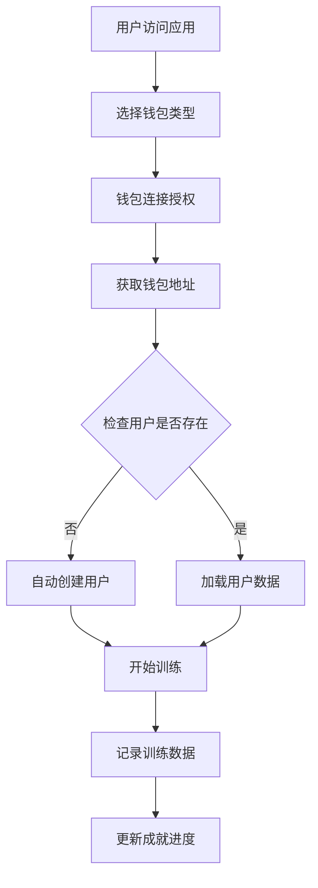

# PEED - 健康币圈训练系统

🐢 **PEED (Pelvic Exercise & Endurance Development)** 是一个真正的 Web3 健康训练应用，专注于提肛训练（Tigang Training），通过钱包连接让用户改善身体健康并参与币圈文化。

## 🌟 特性

- 🏥 **科学训练**: 基于医学研究的提肛训练方法
- 💰 **钱包优先**: 通过 Solana 钱包连接，真正的 Web3 体验
- 📊 **数据追踪**: 详细的训练记录和统计分析
- 🏆 **成就系统**: 多种成就徽章，激励持续训练
- 🌍 **多语言**: 支持中文和英文界面
- 🗄️ **双数据库**: 支持 PostgreSQL 和 SQLite
- 🔗 **去中心化**: 基于钱包地址的用户身份管理

## 🚀 快速开始

### 前提条件

- Python 3.8+
- Node.js 16+ (如果需要前端开发)
- PostgreSQL (可选，默认使用 SQLite)
- **Solana 钱包** (Phantom, Solflare, 等)

### 安装依赖

```bash
# 安装 Python 依赖
pip install -r requirements.txt

# 如果使用 Docker 安装 PostgreSQL
docker-compose up -d postgres
```

### 配置环境

1. 复制环境变量文件：
```bash
cp .env.example .env
```

2. 编辑 `.env` 文件：
```env
# 数据库配置
USE_POSTGRES=false  # 设为 true 使用 PostgreSQL
DB_HOST=localhost
DB_PORT=5432
DB_NAME=peed_db
DB_USER=postgres
DB_PASSWORD=postgres

# Flask 配置
FLASK_ENV=development
SECRET_KEY=your_secret_key_here
```

### 运行应用

```bash
# 启动后端服务器
python main.py
```

应用将在 `http://localhost:5000` 启动。

## 💰 钱包连接

PEED 采用钱包优先的设计理念，用户通过连接 Solana 钱包即可开始使用：

### 支持的钱包

- **Phantom** 👻 - 最受欢迎的 Solana 钱包
- **Solflare** 🔥 - 安全可靠的选择
- **Backpack** 🎒 - 新一代多链钱包
- **Coinbase Wallet** 🟦 - Coinbase 官方钱包
- **Trezor** 🔐 - 硬件钱包支持

### 钱包功能

1. **一键连接**: 无需注册，连接钱包即可开始
2. **自动创建**: 首次连接自动创建用户档案
3. **数据绑定**: 训练记录与钱包地址永久关联
4. **跨设备**: 任何设备连接同一钱包即可访问数据

## 📊 数据库支持

### SQLite (默认)
- 零配置，开箱即用
- 数据存储在 `database/peed.db`
- 适合开发和小规模部署

### PostgreSQL (推荐生产环境)
1. 设置 `USE_POSTGRES=true` 在 `.env` 文件中
2. 使用 Docker 快速启动：
```bash
docker-compose up -d postgres pgadmin
```
3. 或手动安装 PostgreSQL 并创建数据库

## 🎯 API 端点

### 钱包相关
- `POST /api/wallet/{user_id}` - 连接钱包
- `DELETE /api/wallet/{user_id}` - 断开钱包

### 用户管理
- `POST /api/auth/register` - 用户注册 (自动触发)
- `POST /api/auth/login` - 用户登录
- `GET /api/profile/{user_id}` - 获取用户资料
- `PUT /api/profile/{user_id}` - 更新用户资料
- `POST /api/profile/{user_id}/avatar` - 上传头像

### 训练系统
- `POST /api/tigang/training/record` - 记录训练
- `GET /api/tigang/training/history/{user_id}` - 训练历史
- `GET /api/tigang/training/stats/{user_id}` - 训练统计
- `GET /api/tigang/training/leaderboard` - 排行榜

### 成就系统
- `GET /api/tigang/achievements` - 所有成就
- `GET /api/tigang/achievements/{user_id}` - 用户成就
- `POST /api/tigang/achievements/check/{user_id}` - 检查成就更新

## 🏋️ 训练系统

### 难度级别

1. **新手级 (Beginner)**
   - 收缩时间: 5秒
   - 放松时间: 5秒
   - 每组次数: 8次
   - 总组数: 2组

2. **入门级 (Intermediate)**
   - 收缩时间: 8秒
   - 放松时间: 8秒
   - 每组次数: 12次
   - 总组数: 3组

3. **精通级 (Advanced)**
   - 收缩时间: 12秒
   - 放松时间: 6秒
   - 每组次数: 15次
   - 总组数: 4组

### 进阶系统
- 新手级: 完成50次训练可进阶
- 入门级: 完成200次训练可进阶
- 精通级: 完成1000次训练达到专家级别

## 🏆 成就系统

- **初试身手**: 完成第一次训练
- **坚持一周**: 连续训练7天
- **百次达人**: 完成100次训练
- **千次专家**: 完成1000次训练
- **马拉松选手**: 累计训练10小时
- **完美一月**: 连续训练30天

## 🛠️ Web3 架构

### 钱包集成流程



### 数据关联

- **主键**: 钱包地址 (wallet_address)
- **用户标识**: 自动生成 (wallet_后8位)
- **数据持久化**: 与钱包地址永久绑定
- **跨平台**: 同一钱包在任何设备访问相同数据

## 🛠️ 开发

### 项目结构

```
peed/
├── main.py                 # 主应用入口
├── requirements.txt        # Python 依赖
├── .env                   # 环境变量
├── docker-compose.yml     # Docker 配置
├── src/
│   ├── models/            # 数据库模型
│   │   └── user.py       # 用户和钱包模型
│   ├── routes/            # API 路由
│   │   ├── user.py       # 用户相关路由
│   │   └── tigang.py     # 训练相关路由
│   └── static/            # 前端文件
│       ├── App.jsx       # 主应用组件
│       ├── ProfilePageWallet.jsx # 钱包资料页面
│       ├── TigangButton.jsx # 训练组件
│       └── api.js        # API 客户端
└── database/              # SQLite 数据库文件
```

### 钱包连接开发

1. **检测钱包**: 自动检测已安装的 Solana 钱包
2. **连接流程**: 标准 Solana 钱包 connect() API
3. **用户创建**: 基于钱包地址自动创建用户档案
4. **数据同步**: 钱包地址作为用户主键

## 🔧 部署

### 使用 Docker

```bash
# 启动完整的服务栈
docker-compose up -d

# 仅启动数据库
docker-compose up -d postgres

# 查看日志
docker-compose logs -f
```

### 生产环境

1. 设置 PostgreSQL 数据库
2. 配置环境变量
3. 部署到支持 WebSocket 的服务器
4. 确保 HTTPS (钱包连接要求)

## 🧪 健康检查

应用提供健康检查端点：

```bash
curl http://localhost:5000/health
```

返回示例：
```json
{
  "status": "healthy",
  "service": "PEED Backend",
  "version": "1.0.0",
  "database": "SQLite - connected",
  "stats": {
    "total_users": 5,
    "total_training_records": 23,
    "total_achievements": 6
  }
}
```

## 📱 使用说明

1. **连接钱包**: 选择并连接您的 Solana 钱包
2. **自动注册**: 系统自动为新钱包创建用户档案
3. **开始训练**: 选择难度级别，开始提肛训练
4. **查看进度**: 在个人资料页面查看详细统计
5. **获得成就**: 完成特定目标解锁成就徽章
6. **跨设备使用**: 在任何设备连接同一钱包即可访问数据

## 🔐 安全性

- **无密码**: 不需要传统用户名密码
- **钱包验证**: 通过钱包签名验证身份
- **数据加密**: 敏感数据加密存储
- **去中心化**: 用户控制自己的身份

## 🌍 Web3 特性

- **真正的 Web3**: 基于钱包的身份系统
- **去中心化**: 无需中心化账户管理
- **跨链兼容**: 支持多种 Solana 钱包
- **未来扩展**: 可集成 NFT 奖励、代币激励等

## 🤝 贡献

欢迎提交 Issues 和 Pull Requests！

## 📄 许可证

MIT License

## 🆘 支持

如果遇到问题，请：

1. 检查钱包是否正确安装和连接
2. 查看 [Issues](https://github.com/your-repo/peed/issues)
3. 检查健康检查端点
4. 提交新的 Issue

---

**连接钱包，开始健康训练！🐢💰** 